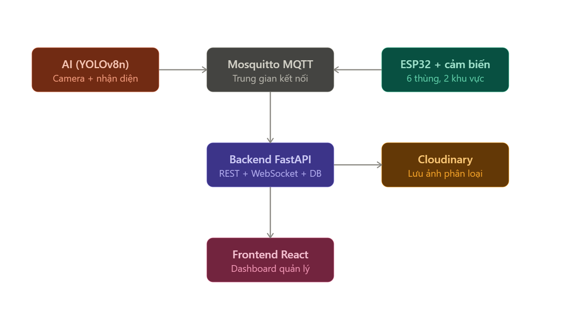

# Vai trò của từng thành phần trong hệ thống

> **Mục đích file này:** giải thích ngắn gọn từng thành phần trong kiến trúc đóng vai trò gì và ai phụ trách — dùng làm bức tranh tổng quan trước khi đọc chi tiết từng mảng.

Xem thêm: [Danh sách phần cứng/phần mềm đầy đủ](./danh-sach-thanh-phan.md)

- **AI (YOLOv8n)** — nhận ảnh từ camera IP (smartphone chạy IP Webcam/DroidCam), phát hiện loại rác, publish kết quả lên MQTT và gửi ảnh qua HTTP. Phần của **Vũ**. Chi tiết logic: [Luồng nhận diện & phân loại rác](../02-luong-xu-ly/luong-nhan-dien-phan-loai.md).
- **ESP32 + cảm biến/servo/LED** — mỗi khu vực 1 ESP32 điều khiển 3 thùng, đọc HC-SR04 đo mực rác, điều khiển servo mở nắp, điều khiển LED xanh (theo thùng) + LED đỏ (theo zone, độc lập), gửi trạng thái online/offline qua LWT. Phần của **Tường**. Chi tiết: [Thiết kế IoT](../03-iot/thiet-ke-iot.md).
- **Mosquitto MQTT broker** — lớp trung gian decoupling: AI và IoT không giao tiếp trực tiếp với nhau hay với Backend, chỉ publish/subscribe qua broker. Giúp 3 module phát triển độc lập. Chi tiết: [MQTT topic & JSON format](../06-mqtt/mqtt-topic-va-json-format.md).
- **Backend FastAPI** — vừa là MQTT subscriber (nhận dữ liệu phân loại, mực rác, trạng thái online) vừa là WebSocket server (đẩy realtime cho Frontend) vừa là REST API (nhận ảnh, phục vụ lịch sử/thống kê). Ghi vào PostgreSQL qua ORM. Phần của **Anh**. Chi tiết: [Kiến trúc Backend realtime](../05-web/kien-truc-backend-realtime.md).
- **Cloudinary** — lưu trữ ảnh phân loại, Backend upload rồi cập nhật `url_anh` vào DB theo `log_id`.
- **Frontend React** — dashboard hiển thị 6 thùng, lịch sử phân loại, thống kê. Load ban đầu qua REST, sau đó nhận cập nhật realtime qua WebSocket. Phần của **Anh**.
