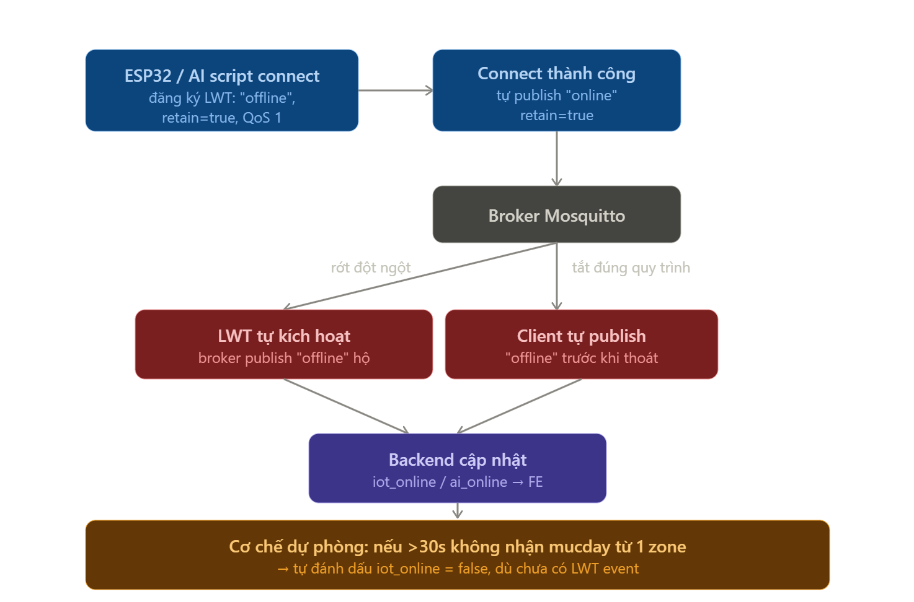

# Luồng cập nhật mức đầy realtime & trạng thái online/offline

> **Mục đích file này:** giải thích luồng dữ liệu mức đầy thùng rác (fill %) và cơ chế phát hiện ESP32/AI script online hay offline, dùng cơ chế MQTT LWT.

Liên quan: [Thiết kế IoT](../03-iot/thiet-ke-iot.md) · [MQTT topic & JSON format](../06-mqtt/mqtt-topic-va-json-format.md) · [Kiến trúc Backend realtime](../05-web/kien-truc-backend-realtime.md)

---

## A. Luồng cập nhật mức đầy (realtime fill %)

1. ESP32 mỗi ~10s đọc HC-SR04 → lấy khoảng cách thô `d` cho từng thùng
2. Publish `d` lên `truong/khu{n}/mucday/{loai_rac}` (QoS 0 — mất gói không sao vì 10s sau có gói mới, không cần đảm bảo)
3. Backend (subscriber) nhận → tra DB theo topic để biết đúng `thung_rac_id` + `chieu_cao_H_cm` → tính `% = (H-d)/H×100`
4. **Validate/clamp** trước khi lưu: `d` bất thường (nhiễu cảm biến, vượt H, âm) → ép về khoảng 0–100%, tránh hiển thị sai kiểu -20% hay 150%
5. UPDATE `phan_tram_day_hien_tai` (ghi đè, không lưu lịch sử)
6. Backend broadcast qua WebSocket: `{thung_rac_id, phan_tram_day}` → FE nhận và cập nhật progress bar tương ứng, không cần reload

## B. Luồng Online/Offline (dùng MQTT LWT)

**LWT (Last Will and Testament)** — cơ chế MQTT: khi client connect, đăng ký sẵn "di chúc" là 1 message; nếu client rớt kết nối đột ngột (mất điện, rớt mạng) mà không kịp disconnect sạch, **broker tự động publish message đó thay client**.

Setup cho cả ESP32 và AI script (2 topic riêng: `trangthai/iot`, `trangthai/ai`):

- Khi connect broker → đăng ký LWT: payload `"offline"`, `retain=true`, QoS 1
- Connect thành công → tự publish `"online"` ngay, cũng `retain=true`
- Khi tắt chủ động (đúng quy trình) → nên tự publish `"offline"` trước khi disconnect, không chỉ trông chờ LWT

Backend subscribe 2 topic này → cập nhật `iot_online` / `ai_online` trong bảng `khu_vuc` (tách riêng như đã chốt) → push WebSocket cho FE cập nhật badge.

> `retain=true` giúp backend mới restart/subscribe lại vẫn lấy được trạng thái hiện tại ngay lập tức, không phải đợi client publish tiếp.

**Lớp bảo vệ bổ sung (khuyến nghị):** LWT không phải lúc nào cũng kích hoạt đúng lúc (mạng treo nhưng chưa drop hẳn TCP). Nên thêm timeout dự phòng: nếu backend không nhận được message `mucday` từ 1 zone trong X giây (ví dụ 30s ≈ 3 chu kỳ gửi), tự đánh dấu `iot_online = false` dù chưa có LWT event — tránh tình trạng "zombie online" (DB báo online nhưng thực tế đã chết).
