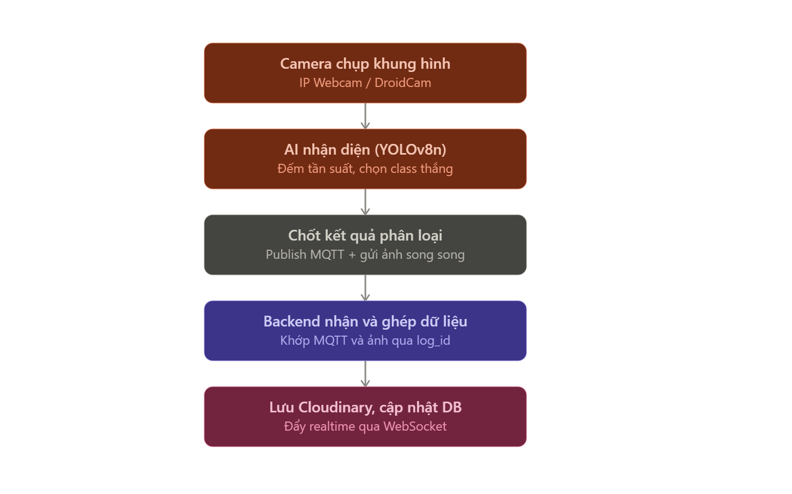

# Luồng xử lý nhận diện & phân loại rác — tài liệu kỹ thuật chi tiết

> **Mục đích file này:** giải thích toàn bộ luồng đi của dữ liệu và logic xử lý khi người dùng đưa rác ra trước camera, cho đến khi dữ liệu được lưu vào hệ thống (hoặc không lưu, tuỳ trường hợp). Cả 3 thành viên (AI, IoT, Web) đều cần đọc để hiểu phần việc của mình khớp với các phần khác thế nào.

Liên quan: [Vai trò từng thành phần](../01-kien-truc-tong-the/vai-tro-thanh-phan.md) · [MQTT topic & JSON format](../06-mqtt/mqtt-topic-va-json-format.md) · [Thiết kế IoT](../03-iot/thiet-ke-iot.md) · [Thiết kế Database](../05-web/thiet-ke-database.md)

---



## 1. Tổng quan kiến trúc liên quan

3 thành phần chính tham gia luồng này, giao tiếp qua **MQTT broker (Mosquitto)** và **HTTP API**:

| Thành phần                             | Vai trò trong luồng này                                                                                                   | Phụ trách |
| -------------------------------------- | ------------------------------------------------------------------------------------------------------------------------- | --------- |
| **AI script** (Python + cv2 + YOLOv8n) | Đọc camera, nhận diện loại rác, publish MQTT, gửi ảnh                                                                     | Vũ        |
| **ESP32 (firmware)**                   | Subscribe MQTT, tự động mở/đóng đúng thùng theo `loai_rac`, điều khiển LED xanh/đỏ (báo detect OK/fail, không theo thùng) | Tường     |
| **Backend (FastAPI)**                  | Subscribe MQTT để ghi DB, nhận ảnh qua API, đẩy realtime qua WebSocket                                                    | Anh       |

Camera đặt kiểu **chụp từ trên xuống, rác đặt lên khay ngang** — giúp nền hình ảnh đồng nhất, giảm nhiễu do người/ánh sáng phía sau.

---

## 2. Sơ đồ luồng tổng thể (trường hợp phân loại thành công)

```
[Người dùng đặt rác lên khay]
            │
            ▼
   [AI script: camera + YOLO]
   (chạy state machine nhận diện)
            │
            ▼
   [Chốt được loại rác + ảnh tốt nhất]
            │
   ┌────────┴────────┐
   ▼                 ▼
[Publish MQTT]   [POST ảnh qua API]
   │                 │
   ▼                 ▼
[ESP32 subscribe] [Backend nhận ảnh]
   │                 │
   ▼                 ▼
[Mở servo +      [PATCH url_anh
 bật LED xanh]    vào row theo log_id]
                      ▲
                      │
        [Backend cũng subscribe MQTT
         → tạo row mới lich_su_phan_loai
         ngay khi có kết quả phân loại]
                      │
                      ▼
        [WebSocket đẩy realtime → Frontend]
```

**Lưu ý quan trọng:** MQTT (kết quả phân loại) và API ảnh là **2 luồng độc lập, chạy song song**, không phụ thuộc lẫn nhau về thời điểm. MQTT thường tới Backend **trước**, ảnh tới **sau** (vì ảnh nặng hơn, cần thời gian encode + upload). Dùng chung `log_id` để nối 2 luồng lại ở bước ghi DB.

Sơ đồ trường hợp **"không tự tin"** (không có kết quả phân loại) khác hẳn — xem mục 4.2, không đi qua Backend/DB.

---

## 3. Chi tiết Bước 1 — AI script nhận diện (State Machine)

### 3.0. Lớp lọc trước khi vào State Machine — chống nhận nhầm khay trống (PA3)

**Vấn đề:** camera nhìn xuống khay có thể khiến model tự nhận nhầm chính cái khay (bề mặt, vân, ánh sáng phản chiếu) thành 1 loại rác, dù khay đang trống.

**Giải pháp đã chốt (PA3 — frame differencing):**

1. Chụp sẵn 1 **"ảnh nền"** (background frame) lúc khay đang trống, làm mốc so sánh
2. Mỗi frame camera đọc được, so sánh với ảnh nền bằng **frame differencing** (dùng cv2 thuần, không cần chạy model)
3. **Chỉ khi độ khác biệt vượt ngưỡng** (có vật thể mới xuất hiện) mới cho phép chạy YOLO
4. Nếu không có gì thay đổi → bỏ qua, không chạy YOLO, không tốn tài nguyên xử lý

```
[Đọc frame camera]
        │
        ▼
[So sánh với ảnh nền khay trống — frame differencing]
        │
   Có khác biệt đáng kể?
    ┌───┴───┐
   Không    Có
    │        │
    ▼        ▼
 (bỏ qua,  [Cho phép chạy YOLO
 không     → vào state machine
  chạy      IDLE/DETECTING/COOLDOWN]
  YOLO)
```

> Ghi chú thêm: dataset training nên có thêm ảnh khay trống làm "negative sample" (không bounding box), chọn khay màu trung tính/mờ/không phản chiếu — hỗ trợ thêm nhưng PA3 vẫn là lớp chặn chính.

### Vấn đề cần giải quyết (của state machine)

Camera chạy liên tục (vd 10 frame/giây). Nếu publish ngay mỗi khi model detect ra object, sẽ:

- Publish nhiều lần cho cùng 1 lần bỏ rác
- Bị nhiễu: 1 frame do góc sáng lạ detect nhầm loại rác (hallucination)
- Không biết khi nào nên coi là "đã chốt xong"

### 3.1. Giải pháp: máy trạng thái (state machine) gồm 3 trạng thái

```
IDLE ──(thấy object)──► DETECTING ──(hết cửa sổ tích lũy)──► [Chốt kết quả] ──► COOLDOWN ──(hết thời gian nghỉ)──► IDLE
                              │
                              └──(mất object liên tục, miss_count đủ ngưỡng)──► IDLE (không publish gì, không LED nào bật)
```

#### Trạng thái `IDLE`

- Trạng thái mặc định, chưa có gì trong khay (đã qua lớp lọc frame differencing ở mục 3.0)
- Mỗi frame chạy YOLO: nếu có object confidence vượt ngưỡng tối thiểu (vd 0.6) → chuyển `DETECTING`

#### Trạng thái `DETECTING` — giai đoạn tích lũy dữ liệu

- Mở cửa sổ thời gian ngắn (vd 1.5 giây)
- Mỗi frame trong cửa sổ đều chạy YOLO và ghi nhận:
  - Đếm số lần mỗi class xuất hiện (counter)
  - Giữ lại frame confidence cao nhất từng thấy của mỗi class
- Nếu tạm thời không thấy object (`miss_count` tăng):
  - Vượt ngưỡng (vd 5 frame liên tiếp, ~0.3–0.5s) → **huỷ phiên, về `IDLE`, không publish gì, không bật LED nào** (hành vi bình thường, không phải lỗi)
  - Thấy lại trước khi vượt ngưỡng → reset `miss_count` về 0

#### Chốt kết quả khi hết cửa sổ tích lũy

**Loại rác được chọn KHÔNG phải class của frame confidence cao nhất trong cả cửa sổ**, mà là:

1. **Class thắng** = class xuất hiện **nhiều lần nhất** qua các frame (vote theo số phiếu, không phải điểm cao nhất)
2. **Ảnh lưu** = frame confidence cao nhất, **chỉ tính trong nhóm frame thuộc class đã thắng**

**Ví dụ:** bỏ 1 chai nhựa (tái chế), cửa sổ 1.5s có 15 frame. 13/15 frame detect đúng "tái chế" (conf 0.65–0.85). 1 frame do ánh sáng lạ detect nhầm "hữu cơ" conf 0.92.

- Nếu chọn theo "conf cao nhất toàn cửa sổ" → chốt sai "hữu cơ" (0.92 cao nhất), dù đa số nói "tái chế".
- Nếu chọn theo "vote tần suất + ảnh đẹp nhất trong nhóm thắng" → chốt đúng "tái chế" (13 phiếu > 1 phiếu).

### Sau khi chốt xong → chuyển sang `COOLDOWN`

- Nghỉ vài giây cố định (vd 5s), không detect nữa, tránh 1 lần bỏ rác bị tính nhiều lần
- Hết thời gian nghỉ → về `IDLE`

---

## 4. Trường hợp đặc biệt — model không đủ tự tin

### 4.1. Điều kiện xảy ra

Hết cửa sổ `DETECTING` mà **không có class nào đạt đủ số lần xuất hiện tối thiểu** (model detect lung tung, không class nào chiếm ưu thế rõ ràng).

### 4.2. Xử lý — đã chốt, khác hẳn luồng phân loại thành công

- AI **publish 1 tín hiệu riêng** báo "không tự tin" (không kèm `loai_rac` cụ thể, không kèm `log_id` vì không cần ghép với ảnh nào cả)
- ESP32 nhận tín hiệu này → bật **LED đỏ của zone** — LED đỏ này **độc lập hoàn toàn với LED xanh**, và cả 2 LED đều không gắn theo thùng cụ thể nào — chúng chỉ báo hiệu "detect được hay không" (xem [Thiết kế IoT](../03-iot/thiet-ke-iot.md))
- Người dùng nhìn thấy LED đỏ → **tự phân loại thủ công**
- **Backend KHÔNG tạo row nào trong `lich_su_phan_loai`** cho case này — vì không có kết quả phân loại thật sự để lưu, không có giá trị thống kê. Về cơ bản Backend không cần xử lý gì với tín hiệu này (đây là luồng AI → ESP32 trực tiếp qua MQTT, Web đứng ngoài)
- Không gửi ảnh, không có `log_id`, không có gì đi qua Backend cho case này

**Format chính xác của tín hiệu này trên MQTT (topic nào, field nào) vẫn còn là điểm cần Vũ và Tường chốt cùng nhau** — xem đề xuất tạm trong [MQTT topic & JSON format](../06-mqtt/mqtt-topic-va-json-format.md#tín-hiệu-không-tự-tin-đề-xuất---cần-chốt).

### So sánh nhanh 3 kết quả có thể xảy ra sau `DETECTING`

| Kết quả                              | Publish MQTT?                | LED nào bật? (cấp zone, không theo thùng) | Servo                 | Có ghi vào DB không? |
| ------------------------------------ | ---------------------------- | ----------------------------------------- | --------------------- | -------------------- |
| Phân loại thành công                 | Có — topic `phanloai` đầy đủ | LED xanh của zone (báo detect OK)         | Tự động mở đúng thùng | Có                   |
| Không tự tin (không class nào thắng) | Có — tín hiệu riêng          | LED đỏ của zone (báo detect fail)         | Không mở gì           | **Không**            |
| Mất object giữa chừng (miss_count)   | Không publish gì cả          | Không LED nào cả                          | Không mở gì           | Không                |

---

## 5. Chi tiết Bước 2 — Chốt xong (thành công) thì làm gì

Ngay khi state machine chốt được kết quả, AI script thực hiện **đồng thời 2 việc độc lập**:

### Nhánh A — Publish MQTT

- Tạo `log_id` (UUID, tự sinh ở AI script, không cần xin Backend cấp trước)
- Gửi payload JSON lên topic `truong/khu{n}/phanloai`: `log_id`, `loai_rac`, `confidence`, `timestamp` (ISO 8601 UTC)
- QoS 1

### Nhánh B — Gửi ảnh qua API

- Encode ảnh (frame tốt nhất đã chọn ở mục 3.1, **không phải** frame tại thời điểm chốt)
- POST multipart lên Backend kèm `log_id` giống hệt bên MQTT
- Chạy **bất đồng bộ (async)**, không chặn vòng lặp camera chính

**Vì sao tách 2 nhánh:** MQTT nhẹ, nhanh, phù hợp cho ESP32 phản ứng ngay (mở thùng). Ảnh nặng hơn, upload chậm hơn, có thể lỗi mạng. Nếu gộp chung, ESP32 phải chờ ảnh upload xong mới mở được thùng — delay không cần thiết.

---

## 6. Chi tiết Bước 3 — ESP32 xử lý (chỉ áp dụng cho case phân loại thành công)

ESP32 subscribe sẵn `truong/khu{n}/phanloai`. Khi nhận message:

1. Kiểm tra `loai_rac` khớp thùng nào trong 3 thùng
2. **Mở servo** đúng thùng đó — tự động, dựa hoàn toàn vào field `loai_rac`
3. **Bật LED xanh của zone** (không phải của riêng thùng đó) — chạy song song với việc mở servo, chỉ để báo cho người dùng biết "detect thành công", không mang thông tin thùng nào
4. Dùng timer **non-blocking** (`millis()`, không `delay()`) để sau vài giây (vd 3–5s): đóng servo + tắt LED xanh

**Điểm quan trọng:** ESP32 không cần AI gửi thêm lệnh "đóng" — toàn bộ vòng đời mở → giữ → đóng do firmware ESP32 tự quản lý bằng timer.

**Về LED — 2 loại tách biệt về phần cứng, cả 2 đều là tín hiệu cấp zone:**

- 🟢 **LED xanh** (1/zone): bật khi ESP32 nhận MQTT phân loại thành công — chỉ báo "detect OK", không gắn với thùng cụ thể nào (việc mở đúng thùng là do servo tự lo)
- 🔴 **LED đỏ** (1/zone, độc lập): bật khi nhận tín hiệu "không tự tin" từ AI — báo "detect fail", cũng không thuộc về thùng cụ thể nào

Chi tiết đầy đủ về logic LED, chân GPIO: [Thiết kế IoT](../03-iot/thiet-ke-iot.md).

---

## 7. Chi tiết Bước 4 — Backend xử lý (chỉ áp dụng cho case phân loại thành công)

Backend đóng đồng thời 3 vai trò: FastAPI server (REST), MQTT subscriber, WebSocket server. MQTT subscriber chạy nền, độc lập với vòng đời request/response.

### 7.1. Khi nhận message MQTT trên topic `phanloai`

- Backend là 1 MQTT client (subscriber), chạy trong thread/task riêng
- Gọi thẳng hàm insert vào DB qua ORM session (cùng process, không qua HTTP nội bộ)
- Tạo **row mới** trong `lich_su_phan_loai`: `log_id`, `loai_rac`, `khu_vuc`, `timestamp` từ payload; `url_anh = NULL` (chưa có ảnh)

> Nhắc lại: tín hiệu "không tự tin" (mục 4) **không đi qua bước này** — không tạo row nào.

### 7.2. Khi nhận ảnh qua API POST

- HTTP endpoint thật sự (khác 7.1)
- Backend nhận ảnh + `log_id` → upload Cloudinary → lấy URL
- Tìm row theo `log_id` → **PATCH** `url_anh`

**Vì sao "tạo row trước, ảnh null, patch sau":** MQTT và ảnh đến 2 thời điểm khác nhau, không đoán trước được. Nếu chờ đủ cả 2 mới ghi DB: dữ liệu phân loại bị delay không cần thiết, và nếu ảnh lỗi mạng thì mất luôn cả dữ liệu phân loại dù bản thân nó vẫn có giá trị thống kê.

### 7.3. Ảnh lỗi mạng (không POST được) — đơn giản hoá, không tự động retry

Team quyết định không tự làm retry logic tự động. Hướng xử lý thủ công:

1. AI POST ảnh thất bại → lưu thẳng vào thư mục cục bộ (`log_id/` gồm ảnh gốc + file text ghi chú metadata)
2. Không có tiến trình tự động retry
3. Quản lý kiểm tra dòng thiếu ảnh (`url_anh IS NULL`), tìm ảnh theo `log_id` trong thư mục cục bộ, **upload lại thủ công** qua giao diện FE

### 7.4. Về phía quản lý (dọn dẹp dữ liệu)

- Không cần enum trạng thái ảnh riêng trong DB — lọc bằng `url_anh IS NULL`
- FE có bộ lọc `ảnh = null`
- Quản lý: đối chiếu thư mục cục bộ → upload thủ công qua FE (PATCH `url_anh`); nếu không đối chiếu được → tự quyết định xoá dòng hay không
- Cần **API xoá hàng loạt** (batch delete), nhận danh sách `log_id`/`id`, xoá trong 1 transaction
- FE có checkbox chọn nhiều dòng + nút "Xoá các mục đã chọn"
- **Giá trị phụ:** nếu 1 khu vực hay bị `url_anh = NULL` liên tục mà không có gì trong thư mục cục bộ đối chiếu → có thể là dấu hiệu camera/kết nối khu vực đó có vấn đề phần cứng

### 7.5. Giới hạn đã biết của hệ thống

Nếu người dùng cố tình tránh camera (đứng khuất, che tay) rồi tự bỏ rác vào — hệ thống **không có cách nào phát hiện được**. Đây là giới hạn cứng, ghi vào phần "hạn chế của hệ thống" trong báo cáo đồ án thay vì cố xử lý.

---

## 8. Chi tiết Bước 5 — Frontend cập nhật realtime

- Backend đồng thời là WebSocket server
- Ngay sau khi ghi/patch DB xong (mục 7.1, 7.2), Backend đẩy sự kiện qua WebSocket
- Frontend nhận được → cập nhật Dashboard (trạng thái 6 thùng, % đầy) và bảng lịch sử phân loại **theo thời gian thực**, không cần refresh
- Lần tải trang đầu tiên vẫn dùng REST API; WebSocket chỉ lo phần cập nhật sau đó
- **Lưu ý:** video stream trực tiếp từ camera **không** đi qua DB hay MQTT — tách biệt hoàn toàn với luồng dữ liệu phân loại

---

## 9. Tổng kết bảng trách nhiệm theo từng người

_(bảng tham khảo, nhóm tự rà lại và phân công chính thức sau)_

| Phần việc                                                                                                                            | Người phụ trách | Liên quan mục nào |
| ------------------------------------------------------------------------------------------------------------------------------------ | --------------- | ----------------- |
| Frame differencing chống nhận nhầm khay trống (PA3)                                                                                  | Vũ (AI)         | Mục 3.0           |
| State machine nhận diện (IDLE/DETECTING/COOLDOWN), vote theo tần suất, chọn frame tốt nhất                                           | Vũ (AI)         | Mục 3.1           |
| Publish tín hiệu "không tự tin" khi không class nào thắng                                                                            | Vũ (AI)         | Mục 4             |
| Publish MQTT payload thành công, encode + POST ảnh async, lưu cục bộ khi lỗi mạng (không tự retry)                                   | Vũ (AI)         | Mục 5, 7.3        |
| Subscribe MQTT, mở/đóng servo đúng thùng bằng timer non-blocking, điều khiển LED xanh + LED đỏ (cả 2 đều cấp zone, không theo thùng) | Tường (IoT)     | Mục 6             |
| Buzzer/loa (mở rộng sau, chưa bắt buộc)                                                                                              | Tường (IoT)     | Mục 6             |
| MQTT subscriber ghi row mới (chỉ case thành công), API nhận ảnh + patch URL, API upload thủ công, API batch delete, WebSocket        | Anh (Web)       | Mục 7, 8          |
| Bộ lọc ảnh null, checkbox chọn nhiều dòng, nút xoá hàng loạt, giao diện upload ảnh thủ công theo log_id                              | Anh (Web)       | Mục 7.4           |

---

_Tài liệu này mô tả riêng phần "luồng xử lý nhận diện rác" — không bao gồm auth, thống kê, cấu trúc DB đầy đủ (xem [Thiết kế Database](../05-web/thiet-ke-database.md))._
